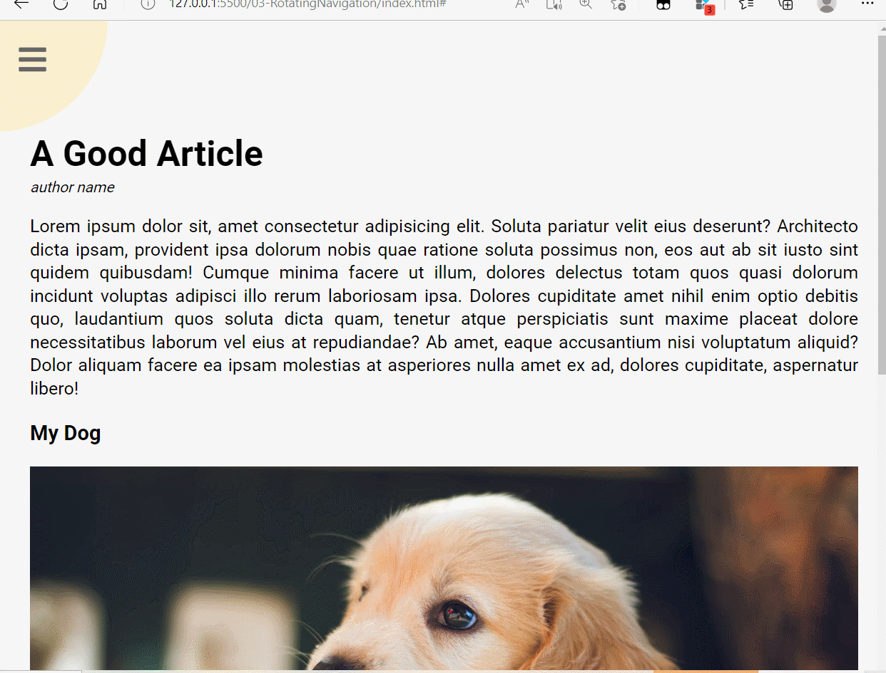
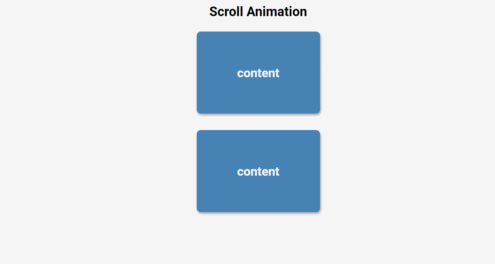
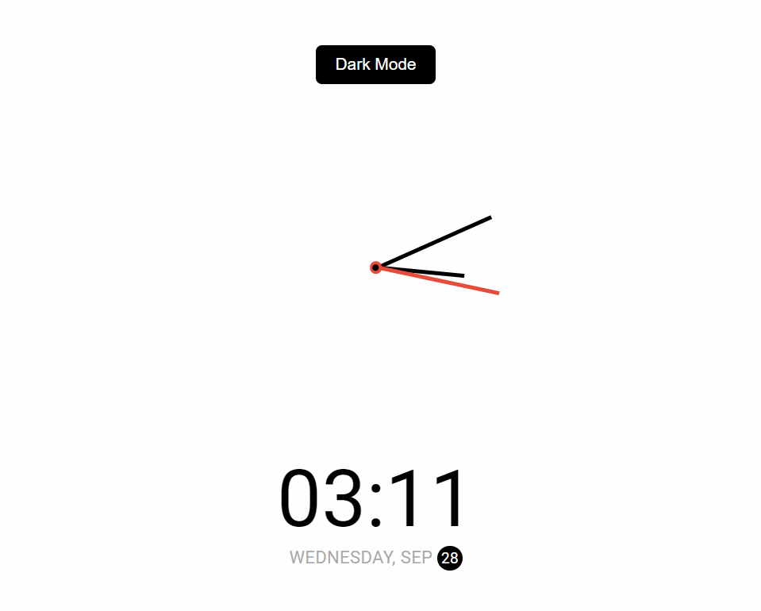

# 前端项目
只使用html、css和JavaScript，完成炫酷的效果~
不使用任何框架，开箱即用。

本项目适合于初学者以及有一定web开发基础的人。欢迎star、fork和issue。

## 01-Expanding Cards
扩展卡片，点击某张卡片则会放大某张卡片

## 02-Progress Bar

进度条，点击之后会跳转到下一个节点。

## 03-RotatingNavigation

实现旋转导航

## 04-Search

实现搜索框，点击图标即可展开搜索框，点击外部或者再次点击图标，关闭搜索框。

## 05-Blur Loading

模糊加载，数字自动从0-100，数字透明度变高，背景的模糊程度变小。

## 06-ScrollAnimation

向下滑动或者向上滑动时，让content进入或离开。

## 07-SplitLoginPage

一个简单的登录页面，鼠标悬浮在某一侧时，会拉伸这一部分。

## 08-LoginForm

登录页面，点击某一个输入框之后，label会有波纹上升的效果。

## 09-ButtonAudio

一堆按钮，点击某个按钮之后会发出对应的声音，如果有其他声音正在播放，会暂停别的声音开始播放新的声音。

## 10-FetchJoke

发起异步请求，有fetch和async+await两种方式。

## 11-keyCodes

按下按键之后，会展示这个按键的key、keycode和code

## 12-FAQExpand

点击按钮，完成答案的展开和收缩

## 13-RandomSelect

随机选择，下面的label是上面输入字符串用逗号分隔的结果，会忽略空白字符，按下`Enter`后从这些label中随机选择最终结果。

## 14-AnimationNAv

通过点击来完成导航的拉伸和缩放

## 15-IncrementCount

自动增加到某一个数值

## 16-drinkWater

模拟喝水，一个不错的锻炼css和js的项目

## 17-MovieShow

集成第三方API，申请电影，并将最终的结果进行渲染，同时完成了搜索功能。

## 18-BackSlide

点击按钮，切换背景图片

## 19-TimeClock

模仿时钟运行，并完成了黑夜模式和白天模式的切换

## 20-ButtonPro

特殊的点击效果，点击按钮会出现水波纹的效果

## 21-DragAndDrop

拖动完成图片的放置

## 22-canvas

简单的画板网页，可以改变笔的粗细和笔的颜色，可清除画板

## 23-cssLoading

用css实现网页loading

## 24-Content Placeholder

内容预加载

